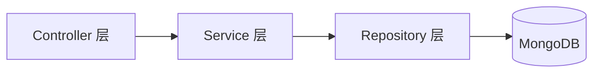

# 技术架构

NexCore 采用现代化的技术栈，确保系统的高性能、可扩展性与开发效率。我们坚持 **前后端分离**、**API 契约驱动** 与 **容器化部署** 的工程原则。

## 🛠️ 核心技术栈

### 前端 (Frontend)

构建极致的用户体验，关注性能与交互细节。

| 技术 | 说明 |
| :--- | :--- |
| **Vue 3** | 核心框架，使用 Composition API 构建逻辑复用性强的组件 |
| **TypeScript** | 全面类型安全，减少运行时错误，提升维护性 |
| **Element Plus** | 企业级 UI 组件库，深度定制主题以符合品牌调性 |
| **Vite** | 极速构建工具，提供秒级热更新体验 |
| **Pinia** | 轻量级状态管理，模块化管理应用状态 |

### 后端 (Backend)

稳健、高效的服务端架构，支撑复杂业务逻辑。

| 技术 | 说明 |
| :--- | :--- |
| **Flask / FastAPI** | Python 微服务框架，灵活轻量，完美对接 AI 生态 |
| **MongoDB** | 文档型数据库，灵活应对数据结构变化，适合快速迭代 |
| **Redis** | 高性能缓存与消息队列，提升系统响应速度 |
| **Docker** | 容器化部署，确保环境一致性与快速交付 |

### AI 与算法 (AI & Algorithms)

从模型研发到工程落地的全链路支持。

| 技术 | 说明 |
| :--- | :--- |
| **PyTorch** | 深度学习框架，用于模型训练与微调 |
| **Hugging Face** | 预训练模型库，快速复用 SOTA 模型 |
| **ONNX Runtime** | 跨平台高性能推理引擎，加速模型部署 |
| **LangChain** | 构建 LLM 应用的编排框架 |

---

## 📐 架构设计原则

### 1. 前后端解耦
- **通信协议**：统一使用 RESTful API (`/api/v1/*`) 进行交互。
- **契约优先**：开发前先定义 OpenAPI/Swagger 文档，前后端并行开发。

### 2. 分层架构
后端代码严格遵循分层设计，确保职责单一：



- **Controller**: 处理 HTTP 请求，参数校验。
- **Service**: 核心业务逻辑，事务管理。
- **Repository**: 数据访问抽象，屏蔽数据库细节。

### 3. 统一规范
- **响应格式**: 所有接口返回统一的数据结构。
  ```json
  {
    "code": 200,
    "message": "success",
    "data": { ... }
  }
  ```
- **错误处理**: 全局异常捕获，返回标准错误码。

---

## 🚀 工程化实践

::: tip 自动化流程
我们引入了 CI/CD 流程，代码提交后自动触发 lint 检查、单元测试与构建部署，确保高质量交付。
:::

- **Git Flow**: 规范的分支管理策略。
- **Code Review**: 严格的代码审查机制。
- **Linting**: Eslint + Prettier + Black (Python) 统一代码风格。
