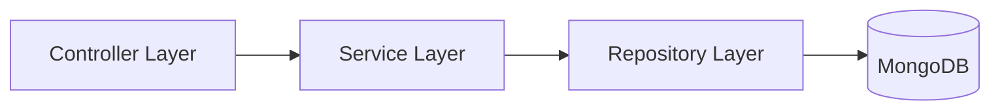

# Technical Architecture

NexCore adopts a modern technology stack to ensure high performance, scalability, and development efficiency. We adhere to engineering principles of **frontend-backend separation**, **API contract-driven development**, and **containerized deployment**.

## 🛠️ Core Tech Stack

### Frontend

Building ultimate user experiences, focusing on performance and interaction details.

| Tech | Description |
| :--- | :--- |
| **Vue 3** | Core framework, using Composition API for reusable logic |
| **TypeScript** | Full type safety, reducing runtime errors and improving maintainability |
| **Element Plus** | Enterprise-grade UI library, customized to fit brand identity |
| **Vite** | High-speed build tool providing instant hot module replacement |
| **Pinia** | Lightweight state management for modular application state |

### Backend

Robust and efficient server-side architecture supporting complex business logic.

| Tech | Description |
| :--- | :--- |
| **Flask / FastAPI** | Python microservice frameworks, flexible and lightweight, perfect for AI ecosystem |
| **MongoDB** | Document-oriented database, flexible for data structure changes and rapid iteration |
| **Redis** | High-performance cache and message queue for system responsiveness |
| **Docker** | Containerized deployment ensuring environment consistency and rapid delivery |

### AI & Algorithms

Full-link support from model research to engineering implementation.

| Tech | Description |
| :--- | :--- |
| **PyTorch** | Deep learning framework for model training and fine-tuning |
| **Hugging Face** | Pre-trained model library for rapid reuse of SOTA models |
| **ONNX Runtime** | Cross-platform high-performance inference engine for model deployment |
| **LangChain** | Orchestration framework for building LLM applications |

---

## 📐 Architecture Principles

### 1. Frontend-Backend Decoupling
- **Protocol**: Unified interaction via RESTful API (`/api/v1/*`).
- **Contract First**: Define OpenAPI/Swagger documentation before development for parallel workflows.

### 2. Layered Architecture
Backend code strictly follows layered design to ensure single responsibility:



- **Controller**: Handles HTTP requests and parameter validation.
- **Service**: Core business logic and transaction management.
- **Repository**: Data access abstraction, hiding database details.

### 3. Unified Standards
- **Response Format**: All interfaces return a unified data structure.
  ```json
  {
    "code": 200,
    "message": "success",
    "data": { ... }
  }
  ```
- **Error Handling**: Global exception capturing returning standard error codes.

---

## 🚀 Engineering Practices

::: tip Automation
We have introduced CI/CD processes. Code submission triggers automatic linting, unit testing, and build deployment to ensure high-quality delivery.
:::

- **Git Flow**: Standardized branch management strategy.
- **Code Review**: Strict code review mechanism.
- **Linting**: Eslint + Prettier + Black (Python) for unified code style.
